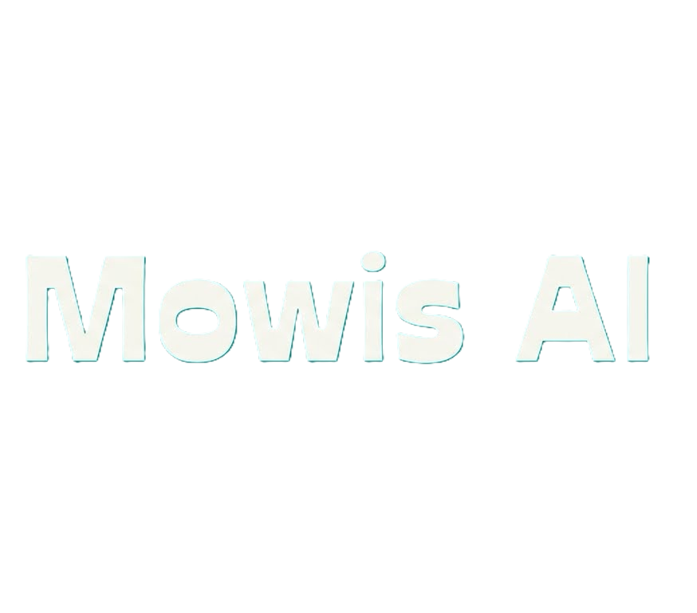

# MominAI Website

The official landing page for **MominAI**, an agent-native execution substrate designed to safely host autonomous AI agents in isolated environments.



## 🚀 Overview

This website serves as the primary gateway for MominAI, explaining the core problems with current agent frameworks (direct OS access, lack of isolation) and presenting the MominAI runtime solution (Sandbox, Brain/Hands model, Governance Laws).

It is built as a highly responsive Single Page Application (SPA) with a premium "Glassmorphism" aesthetic.

## ✨ Features

*   **Premium Aesthetic**: Dark mode, gradients, and glass-morphism UI.
*   **Smooth Animations**: Orchestrated entrance animations using `framer-motion`.
*   **Multi-Page Routing**:
    *   **Home**: Narrative flow through Principles and Architecture.
    *   **Problem**: In-depth analysis of current agent security gaps.
    *   **Specification**: Full markdown rendering of the v0.1 Design Doc with **live Mermaid charts**.
    *   **Contact**: Minimalist contact gateway.
*   **Responsive Design**: Mobile-first architecture with adaptive layouts and navigation.

## 🛠️ Tech Stack

*   **Runtime**: [Bun](https://bun.sh)
*   **Framework**: [React](https://react.dev) + [Vite](https://vitejs.dev)
*   **Styling**: CSS Modules + Variables (No external CSS frameworks)
*   **Animations**: `framer-motion`
*   **Routing**: `react-router-dom`
*   **Docs**: `react-markdown` + `mermaid-js`

## 🏃‍♂️ Getting Started

1.  **Clone the repository**
    ```bash
    git clone https://github.com/Momin010/MominAI-website.git
    cd MominAI-website
    ```

2.  **Install dependencies**
    ```bash
    bun install
    ```

3.  **Run Development Server**
    ```bash
    bun dev
    ```

4.  **Build for Production**
    ```bash
    bun run build
    ```

## 📂 Project Structure

```
src/
├── assets/        # Images, icons, and textures
├── components/    # Reusable UI components (Navbar, Hero, Laws...)
├── pages/         # Route pages (Home, Problem, Spec, Contact)
├── styles/        # CSS modules and variables
├── App.jsx        # Routing configuration
└── main.jsx       # Entry point
```

## 📜 License

© 2026 MominAI. All rights reserved.
